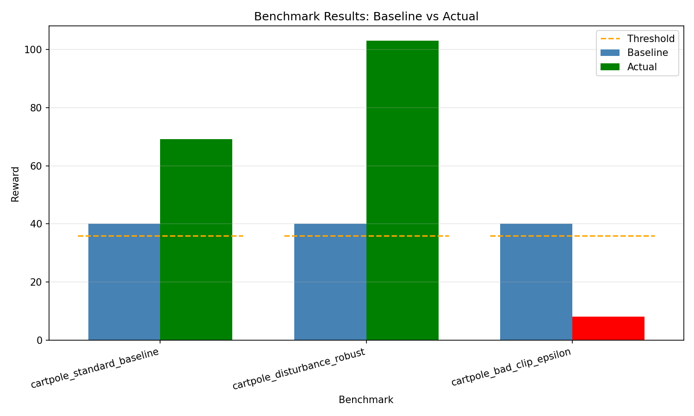

# Benchmark Report

**Suite:** CartPole Benchmark Suite  
**Date:** 2026-06-07 17:29:51 UTC  
**Overall Status:** REGRESSION DETECTED

## Summary

| Metric | Value |
|--------|-------|
| Total Benchmarks | 3 |
| Passed | 2 |
| Failed | 1 |
| Expected Failures | 0 |

## Results

| # | Benchmark | Baseline | Actual | Ratio | Threshold | Status |
|---|-----------|----------|--------|-------|-----------|--------|
| 1 | cartpole_standard_baseline | 40.0 | 69.2 | 173.0% | >= 90% | PASS |
| 2 | cartpole_disturbance_robust | 40.0 | 102.9 | 257.2% | >= 90% | PASS |
| 3 | cartpole_bad_clip_epsilon | 40.0 | 8.2 | 20.5% | >= 90% | **FAIL - REGRESSION** |

## Chart

## Conclusion

**REGRESSION DETECTED** - The following benchmarks did not meet expectations: cartpole_bad_clip_epsilon

## History Trend

| Date | Status | cartpole_bad_clip_epsilon | cartpole_disturbance_robust | cartpole_standard_baseline |
|------|--------|--------|--------|--------|
| 2026-06-07 17:29 | REGRESSION DETECTED | 8.2 | 102.9 | 69.2 |
